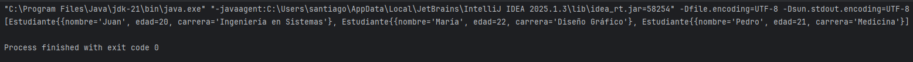

# Práctico de Java: Uso de toString
GitHub
https://github.com/sordi005/java-prog3/tree/main/1

Este es un trabajo práctico para la materia de Programación 3, cuyo objetivo principal es aprender y aplicar el método `toString` en Java.

Esto imprime la lista de estudiantes utilizando el método `toString` de la clase `Estudiante`.

## Salida

